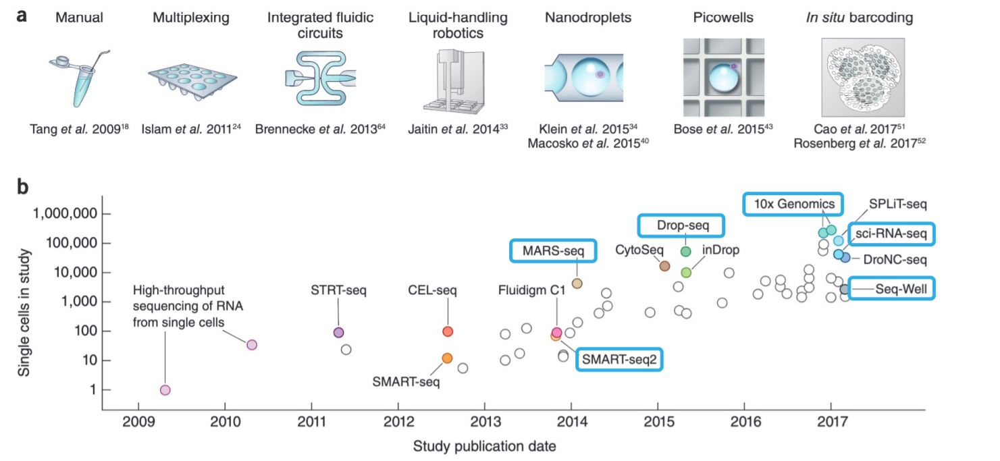
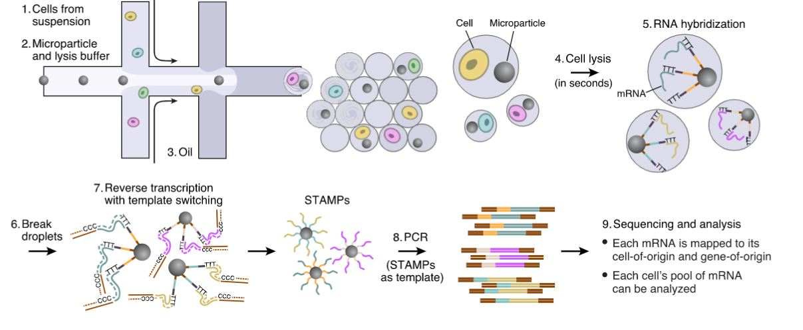
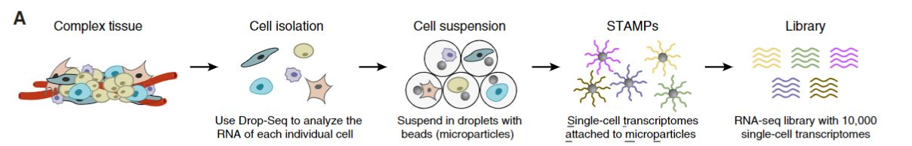
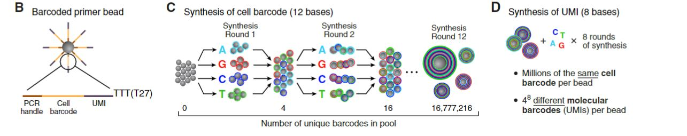
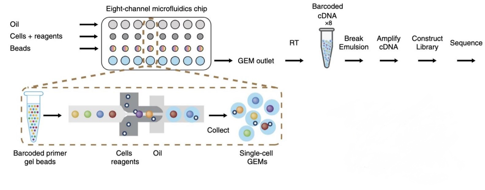

\mainmatter

```{r snRNA, include=FALSE}
knitr::opts_chunk$set(echo      = TRUE,
                      message   = FALSE, 
                      error     = FALSE,
                      cache     = TRUE,
                      fig.align = 'center')
```

# Single-Cell RNA-seq Technologies


```{r echo=FALSE, top, out.width='150%', fig.show='hold', fig.cap="Explosion of scRNA-seq Throughput [-@Svensson2018] "}

```

Technological advances increase the efficiency of single-cell sequencing methods
while the cost decreases day by day. In this chapter, we will briefly go through
some of the single-cell RNA-seq technologies.


## Plate-Based SMART-seq

SMART-seq is a **plate-based single-cell RNA-seq** method that captures **full-length transcripts** using oligo(dT) priming and template-switching reverse transcriptase. Each cell is sorted (e.g., via FACS) into individual wells of a 96- or 384-well plate.

The cDNA is amplified using PCR, and sequencing libraries are prepared from this amplified cDNA. SMART-seq and its improved version **SMART-seq2** are well-suited for detecting isoforms and lowly expressed genes.

*Advantages of SMART-seq:*

- Full-length transcript coverage — useful for isoform and splicing analysis  
- High sensitivity, low dropout rate  
- Compatible with rare/low-throughput samples  

*Limitations of SMART-seq:*

- Lower throughput than droplet-based methods  
- Higher cost and hands-on time per cell  
- Not UMI-based — less accurate quantification  

## MARS-seq

MARS-seq (Massively Parallel Single-Cell RNA-Seq) is another **plate-based scRNA-seq** method that focuses on **3' end-tagged sequencing**. Cells are sorted into 384-well plates containing barcoded primers for mRNA capture. Unique molecular identifiers (**UMIs**) and well-specific barcodes are introduced during reverse transcription.

After cDNA synthesis, all reactions are pooled for linear amplification by IVT (in vitro transcription), followed by library preparation.

*Advantages of MARS-seq:*

- Well-suited for profiling many cells in parallel  
- Supports UMIs — accurate transcript quantification  
- Suitable for low-input samples and immune profiling  

*Limitations of MARS-seq:*

- 3′ bias — cannot resolve isoforms  
- Requires customized primers and plate setup  
- Slightly lower sensitivity compared to SMART-seq  


## Droplet Microfluidics (DROP-seq)

```{r echo=FALSE, dropseq1, out.width='140%', fig.show='hold', fig.cap="Extraction and Processing of Single-Cell Transcriptomes by Drop-Seq [-@Macosko2015] "}

```


DROP-seq enables high throughput profiling of thousands of individual cells in a
short period of time by encapsulating each cell individually with a unique
barcode in a droplet. The process takes place within a microfluidic device.  


```{r echo=FALSE, dropseq2A, out.width='150%', fig.show='hold', fig.cap="Drop-Seq barcoding scheme"}

```


After dissociating the complex tissue sample into individual cells, each cell is
suspended in droplets with microparticle beads which deliver barcoded primers
within a microfluidic device. When cells within the droplet are lysed, the mRNA
of these cells is attached to microparticles.A set of beads are generated with
the reverse transcription of mRNAs into cDNAs. These sets of beads are called
`STAMPs`, "single-cell transcriptomes attached to microparticles". Finally, an
RNA-seq library with about 10,000 single-cell transcriptomes was constructed by
barcode `STAMPs` amplifying.


```{r echo=FALSE, dropseq2B, out.width='150%', fig.show='hold', fig.cap="Sequence of primers on the microparticle"}

```


Each barcoded primer bead contains an unique cell barcode and, an unique
molecular identifiers `(UMI)s` along with the common PCR handle. The common PCR
handle sequences used for PCR amplification after `STAMPs` formation. The cell
barcodes are unique for each droplets, therefore, each microparticles contains
primers with the same cell barcode. `UMIs` are unique barcodes to each
transcript, `UMIs` are counted digitially to count unique number of mRNA
transcripts. And, counting `UMIs`  also removes the uncertainty of PCR
duplicates from transcript copy numbers.


*Limitations of DROP-seq: *

-  Most of the droplets are empty and, very few of the droplets contains both a
cell and microparticle. Thus, it is not an efficient method.


## 10X Genomics Chromium

```{r echo=FALSE, Genomicsx10, out.width='150%', fig.show='hold', fig.cap="10x Genomics Chromium scheme [-@Zheng2017]"}

```


The 10X Genomics method is very similar to DROP-seq and, it is first described
in [-@Zheng2017]. First, the barcoded beads are mixed with the cell suspension.
Then, the mixture is capsulated with the emulsion generated by oil. The
microfluidic device and the barcoded beads of the 10X Genomics are engineered to
increase the efficiency of barcoding cells. Therefore almost 90% of the droplets
contain a cell and a barcoded bead. The main difference between the 10X Genomics
Chromium and DROP-seq is the reverse transcription occurs within the droplets.
After the amplification process, the transcriptomics library is constructed. For
each lanes of a 10X Genomics Chromium chip, approximately 20,000 cells can be
barcoded and sequenced simultaneously.

*Advantages of 10X Genomics Chromium:*

-   10X Genomics is a commercial platform
-   Data obtained is high-throughput
-   Almost 10,000s reads per cell
-   Fast, inexpensive 
-   3’ transcript sequencing
-   Single-nucleus sequencing possible
    -   Less bias by cell morphology
    -   Only captures nuclear RNA

## Nanowell Platforms

Nanowell-based scRNA-seq platforms isolate single cells into thousands of tiny wells patterned on a 
microchip. Each well contains one cell, and barcoded beads or primers are then added to each well. 
After cell lysis, mRNAs are captured by the barcoded oligos on beads, similar to Drop-seq, followed 
by reverse transcription and cDNA amplification.

Common nanowell-based methods include Seq-Well and BD Rhapsody, which allow moderate throughput and 
compatibility with fragile cell types. These platforms combine physical cell isolation with scalable
processing.

*Advantages of Nanowell Platforms*:
-   Gentle on cells — suitable for fragile or rare populations
-   More control over cell-bead pairing than droplet systems
-   Lower equipment complexity vs. droplet microfluidics

*Limitations of Nanowell Platforms*:
-  Lower throughput than 10X or Drop-seq
-  More manual steps — potential for variability
-  Limited capture efficiency compared to high-end droplet systems

## Sample Indexing (Illumina)
Sample indexing involves tagging different samples or individual cells with unique barcode sequences 
(index tags) during library preparation. These tags are incorporated either via adapter ligation or 
during PCR amplification. After sequencing, reads are demultiplexed based on these indexes, enabling
 multiplexing of multiple samples in a single sequencing run.

This method is widely used in plate-based protocols like SMART-seq2 and is foundational in many 
combinatorial indexing strategies.

*Advantages of Sample Indexing*:

-  Cost-efficient multiplexing of samples or conditions
-  Increases throughput without added sequencing lanes
-  Compatible with standard Illumina sequencing workflows

*Limitations of Sample Indexing:*

-  Barcode swapping or misassignment can affect data accuracy
-  Limited by the number of unique index combinations
-  Cannot handle extremely large numbers of cells without additional combinatorial strategies

## Single-cell Combinatorial Indexing: sciRNA-seq

sci-RNA-seq (single-cell combinatorial indexing RNA-seq) enables profiling of thousands to millions 
of cells without physically isolating each cell. Instead, it uses combinatorial barcoding in multiple
 rounds of pooling and splitting cells or nuclei, introducing unique barcode combinations in each round
  (e.g., via transposase or reverse transcription primers).

The method begins with cells or nuclei distributed across multiple wells, where the first set of barcodes
is introduced. The contents are then pooled and redistributed, and another set of barcodes is applied. 
This process repeats across multiple rounds, allowing millions of uniquely labeled single-cell transcriptomes.

*Advantages of sci-RNA-seq*:
-  Ultra-high throughput — millions of cells can be profiled
-  No need for droplet microfluidics or physical single-cell isolation
-  Can be applied to fixed or frozen cells and nuclei
-  Compatible with multi-omic profiling (e.g., sci-ATAC-seq)

*Limitations of sci-RNA-seq*:
-  Lower transcript capture efficiency than droplet-based methods
-  Complex data processing and barcode decoding
-  May require deep sequencing to resolve sparse expression profiles
