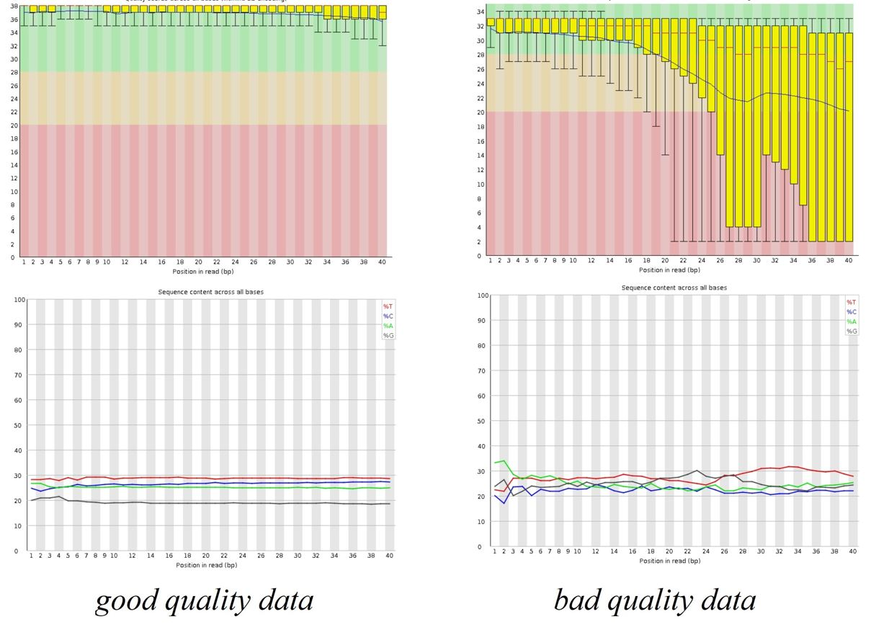

\mainmatter

```{r scRNAprocess, include=FALSE}
knitr::opts_chunk$set(echo      = TRUE,
                      message   = FALSE, 
                      error     = FALSE,
                      cache     = TRUE,
                      fig.align = 'center')
```

# Single-cell RNA-seq Data Processing and Quality Control

Once the raw data is obtained, the first thing to do is to check the quality of
the reads and process it accordingly. In this chapter, we will go through
quality control and processing methods for single-cell data.


## Cell Ranger Pipeline

```{r echo=FALSE, cellRanger, out.width='130%', fig.show='hold', fig.cap="Cell Ranger Pipeline [-@10xGenomics2019]"}
knitr::include_graphics("figures/Cell-Ranger.JPG")
```

In 10X Genomics workflow, which is the main workflow that is commonly used
nowdays, `Cell Ranger pipeline` is used to process Chromium single-cell data to
generating feature-barcode matrices, reading alignment, filtering, clustering
and perform other secondary analysis methodologies.@[-10xGenomics2019]

`Cell Ranger` identifies each sample, cell and molecule. Identification done by
using sequencing barcodes (eg. Illumina i7 and i5 indices) for samples,
cell-specific barcodes for cells and, UMIs for molecules. The typical `Cell
Ranger` results looks like this:

```{r echo=FALSE, cellRanger2, out.width='50%', fig.show='hold', fig.cap="Cell Ranger Pipeline Results [-@10xGenomics2019]"}
knitr::include_graphics("figures/Cell-Ranger2.JPG")
```

In the previous chapter, we mentioned that some of the droplets may contain no
cells. In the qc summary report of the `Cell Ranger pipeline`, `Cell Ranger`
predicts the number of cells within the inputed data and print the estimation in
"Estimated Number of Cells" section. The "Barcode Rank Plot" indicates the
droplets that contains bead but no cell with the grey color. To determine a
cut-off and remove noisy data, bioinformaticians benefit from this plot. The
"Mapping" section of the report indicates percantage of reads that is aligned
successfully to the genome.

* **HINT :** If the mapping rate is low and, you are working with the pure data
(eg. human data) that may indicate contamination.

* **NOTE :** `Cell Ranger` prints error, if there is a quality issue.

### FASTQ File Format 

High-throughput sequencing reads usually outputs `FASTQ` files. `Cell Ranger`
pipeline produces `FASTQ` files as well. Let's take a look at the `FASTQ` file
format below.

```{r echo=FALSE, fastqfile, out.width='150%', fig.show='hold', fig.cap="Structure of a FASTQ file"}
knitr::include_graphics("figures/fastq-file.JPG")
```

Each `FASTQ` file contains three parts. The first line of the `FASTQ` file that
starts with `@`, contains the read identifier, which indicates the position on
the flowcell. The DNA sequence starts from the second line. And the line comes
before another read identifier contains the per-base sequencing quality score
(also called PHRED score). The formula of the PHRED score is given below where P
is the "Probability of base calling error".

```{r echo=FALSE, PHRED, out.width='50%', fig.show='hold', fig.cap="The formula of the PHRED score",fig.align='center'}
knitr::include_graphics("figures/Cell-Ranger3.JPG")
```

### Sequencing Quality : FASTQC tool

Sequence quality can be determined by `FASTQC tool`. `FASTQC tool` provides
simple quality control check on raw sequence data that comes from high
throughput sequencing pipelines. @Anders2010

```{r echo=FALSE, FASTQC, out.width='200%', fig.show='hold', fig.cap="FASTQC Results",fig.align='center'}

```

*FASTQC tool provides:*

* Summary statistics (number of reads, …)
* Sequencing quality summaries
* Sequence biases
* Duplicate reads
* Sequence contamination (adapters, etc.)

### Read trimming

Sequencing data analysis pipelines modify the read sequences produced by a
sequencer. There may be sequence biases due to structural oligonucleotides
(adapters, etc.)  and low-quality sequences. Trimming at reading ends is done as
the first operation in a pipeline to avoid sequence biases.

```{r echo=FALSE, trimming, out.width='80%', fig.show='hold', fig.cap="High-throughput sequencing pipeline scheme",fig.align='center'}

```

There are several softwares present to apply trimming, frequently used ones are:

* [CellRanger](https://support.10xgenomics.com/single-cell-gene-expression/software/pipelines/latest/what-is-cell-ranger)
* [cutadapt](https://cutadapt.readthedocs.io/en/stable/)
* [Trim Galore!](https://www.bioinformatics.babraham.ac.uk/projects/trim_galore/)
* [SeqPurge](https://hub.docker.com/r/virusx/seqpurge/dockerfile)
* [trimmomatic](http://www.usadellab.org/cms/?page=trimmomatic)

## Demultiplexing

```{r echo=FALSE, Demultiplexing, out.width='150%', fig.show='hold', fig.cap="Data processing pipeline workflow.",fig.align='center'}

```

Although the high-throughput sequencing methods provides data with good quality,
errors via PCR can be introduced when preparing the library. When working with
working with single-cell RNA sequencing data the initial cDNA libraries undergo
PCR amplification multiple times. Thus, PCR errors are often introduced when
preparing single-cell RNA sequencing library. Demultiplex is a simple sequencing
error correction algorithm used to prevent this kind of errors. @Zhang2018

Demultiplexing indicates identification of cell barcodes, assigning cell-barcode
to the associated reads and, filtration of cell-barcodes. If the data contains
UMIs, UMI codes are mapped to  the read name of the gene-body containing read.
UMIs are counted for each cell and gene thus, duplicates are avoided. Genes are
identified via sequence mapping. And, if the expected cell-barcodes are known,
assigned barcodes are filtered accordingly.

Demultiplexing is done differently depending on the protocol and the pipeline of
choice. In general, the data obtained from paired-end full transcript protocols
and, Smart-seq2 are already be demultiplexed. If the data was not demultiplexed,
you need to apply it yourself depending on the protocol used to produce raw
data.

## STAR: Ultrafast Universal RNA-seq Aligner

After trimming and, prof the data has good quality, the data needs to be mapped
to the corresponding reference genome. This mapping process is called alignment
and, it is necessary if we're interested in gene expression analysis (eg.
differential gene expression analysis, quantifying etc.) **Kallisto** and
**STAR** are the most popular alignement tools. @Dobin2013

```{r echo=FALSE, STAR, out.width='250%', fig.show='hold', fig.cap="STAR workflow.[-@Piper2017]",fig.align='center'}
knitr::include_graphics("figures/STAR.png")
```

In summary, **STAR** searchs for the longest sequence in the data that is also
present in the reference genome using an uncompressed suffix array (SA). This
process is called seed searching. The longest matching sequences are called "the
Maximal Mappable Prefixes (MMPs)". The MMP side and the unread side are named as
different seeds (eg *seed1*,*seed2*). After finding MMP, **STAR** searchs for
the next the longest sequence. If an exact matching sequence for each part of
the read is not found,the previous MMPs will be extended. And, if extending the
previous MMPs oes not give a good alignment, then the poor quality or adapter
sequence (or other contaminating sequence) will be soft clipped. These process
is repeated for each for unmapped part of the read in forward and reverse
directions. @Dobin2013 **STAR** detects splicing events in this way, because of
that,it also called splice aware aligner.

Then seeds are clustered by proximity to ‘anchor’ seeds (or uniquely mapping
seeds) and, seeds are stitched together based on alignment score using dynamic
programming. The scoring done based on matches, mismatches, insertions,
deletions and splice junction gaps. @Piper2017

## Transcript Quantification: KALLISTO

```{r echo=FALSE, Kallisto, out.width='80%', fig.show='hold', fig.cap="Kallisto workflow.[-@Bray2016]",fig.align='center'}

```

While **STAR** is a read-alinger, **Kallisto** is a pseudo-aligner. That means,
while **STAR** mapp reads to a reference genome, **Kallisto** mapps k-mers.
**Kallisto** assign reads to transcripts without assigning specific positions
for each base. Instead, it uses a *Transcriptome de Bruijn Graph (T-DBG)*. A
k-mer is a nucleotide sequence that length k derived from a read. Each
transcript act as a path  through the graph and, transcriptome reference
represented as consecutive k-mers. Kallisto maps reads to splice isoforms rather
than genes.@Bray2016

*EM-algorithm* is used to estimate transcript abundance and  optimize
compatibility (likelihood). Intersection of vertex compatibility classes
indicates compatible transcripts.


```{r echo=FALSE, Kallisto2,out.width='50%', fig.show='hold', fig.cap="The EM-algorithm formula. ",fig.align='center'}

```


K-mers of reads can be mapped to vertices using their exact matches (also called
*hashing*). Read compatibility is found by matching the read mapping with
transcript-induced paths (compatibility classes). It is much more faster than
read-aligners.  Pseudo-aligners can cope better with sequencing errors. For
example, if k is sufficiently large, the error k-mers may not be part of the
transcriptome and can be ignored.


## The Single-Cell Data


```{r echo=FALSE, scdata,out.width='100%', fig.show='hold', fig.cap="Representation of the single-cell count data ",fig.align='center'}
knitr::include_graphics("figures/scdata.png")
```


The raw counts of single-cell data are integers. The count matrices are sparse
but, high dimensional. Therefore, feature selection and, dimensional reduction
methods are necessary.
 
 
 
## Data normalization

##Dealing with Batch Effects

##Data cleanup (filtering)

##Empty droplets

##Empty droplets
 
## Doublet detection and removal: *demuxlet*

## Doublet detection and removal: *DoubletFinder*

## Doublet detection and removal: *Scrublet*

## Issues of the Single-Cell Data

 
 
 
 
 
## Data imputation / data smoothing

## MAGIC (Markov affinity-based graph imputation of cells)
