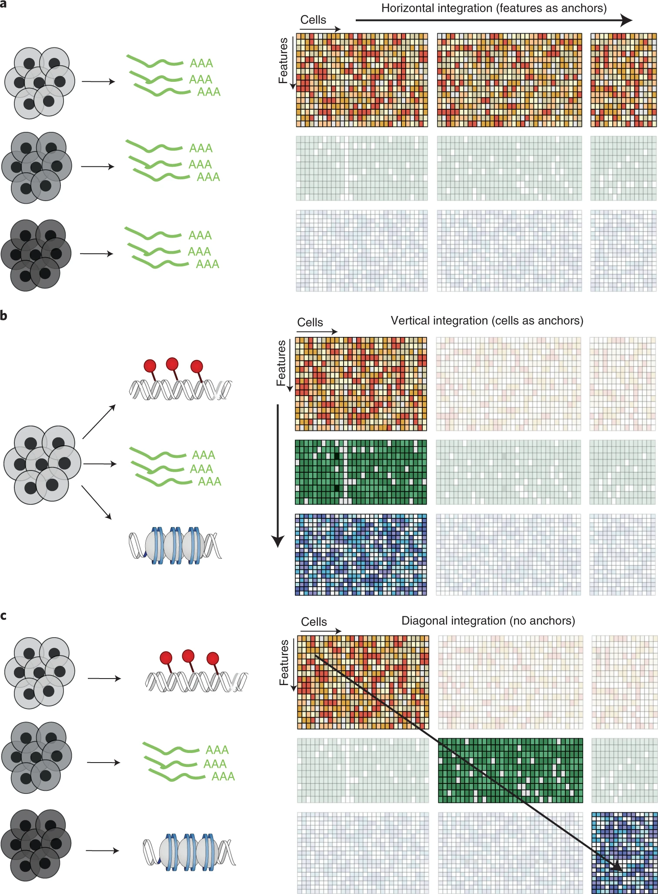
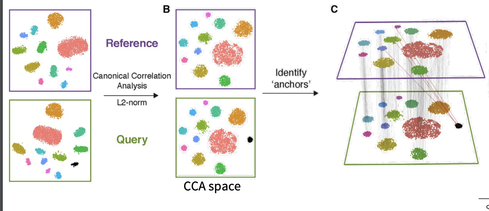
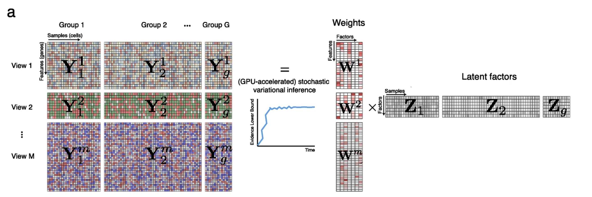
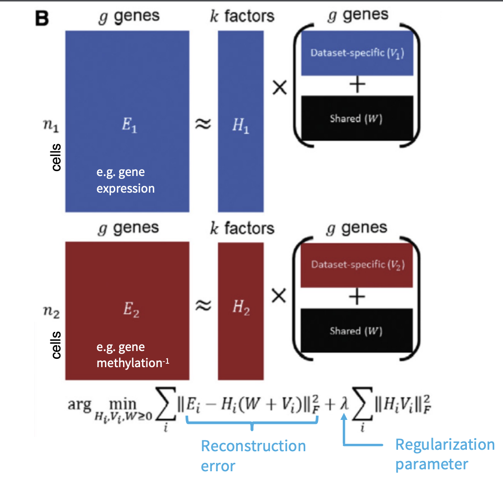
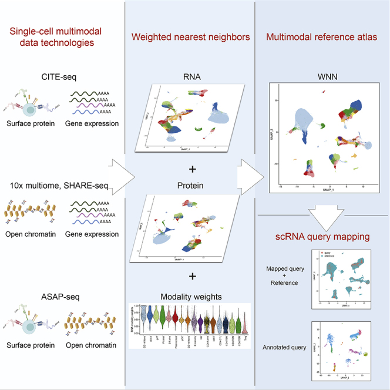
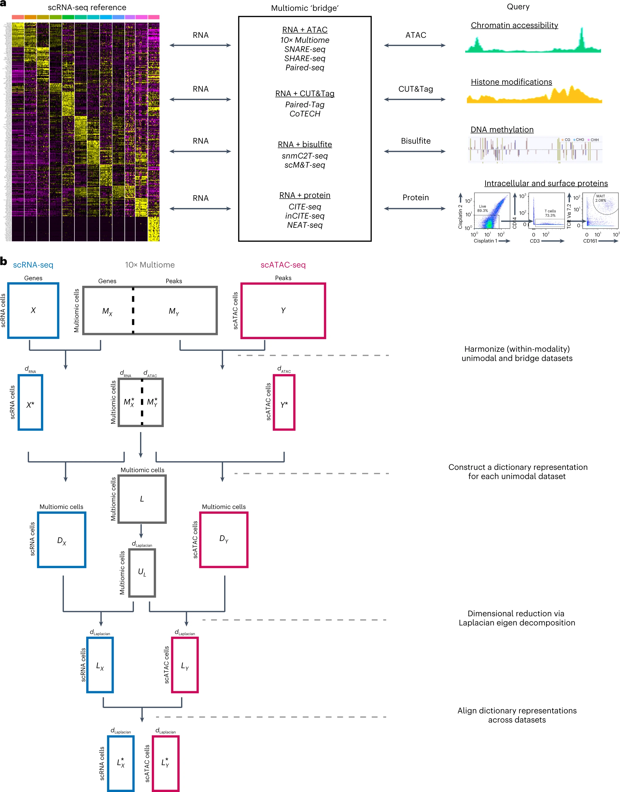
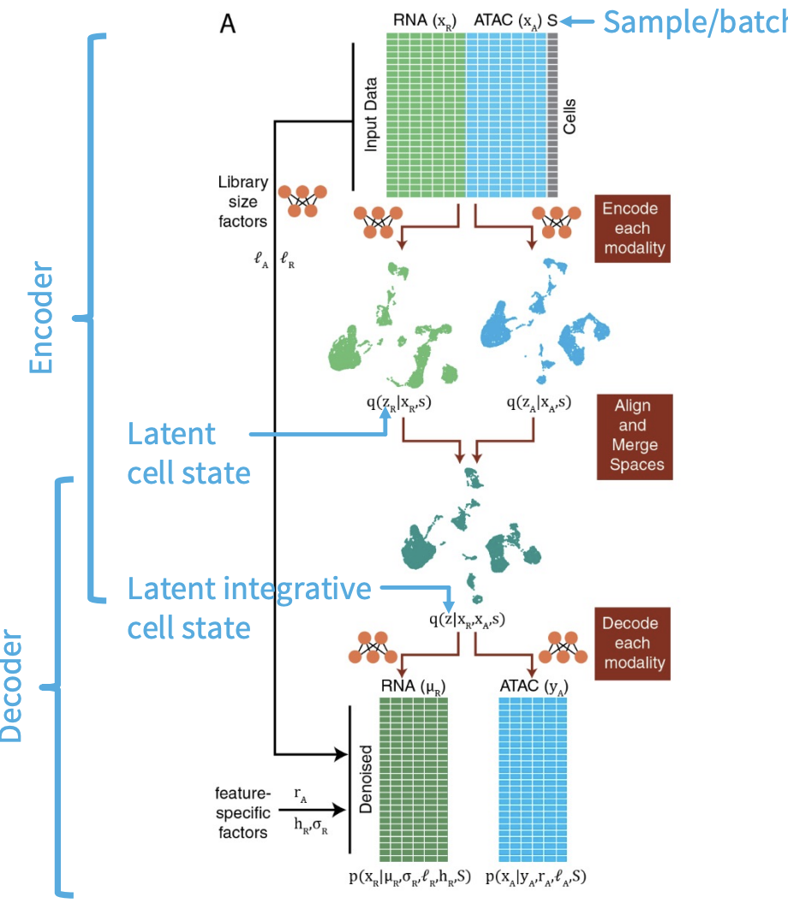

\mainmatter

```{r sintegrate, include=FALSE}
knitr::opts_chunk$set(echo      = TRUE,
                      message   = FALSE, 
                      error     = FALSE,
                      cache     = TRUE,
                      fig.align = 'center')
```

##Integration of Single-Cell Omics Data

```{r echo=FALSE, integration1, out.width='140%', fig.show='hold', fig.cap="Challenges in multi-modal integration"}

```

Integrating single-cell multi-omics data (e.g., scRNA-seq, scATAC-seq) is essential for a holistic understanding of cellular states but comes with challenges:

* Different modalities have distinct statistical properties  
* Confounding biological and technical sources of heterogeneity  
* Missing values and sparsity across datasets  

To tackle these, integration methods are categorized into **horizontal** (across cells or batches) and **vertical** (across modalities in the same cell) approaches.

## Horizontal Integration

Used when cells are assayed with different modalities in different batches.

* Normalize expression and accessibility (e.g., gene activity as a surrogate for expression)  
* Match shared features across modalities  

Popular methods include:

- **CCA (Canonical Correlation Analysis):** Joint projection into a shared subspace  
- **Harmony:** Corrects batch effects using soft clustering  
- **MNN (Mutual Nearest Neighbors):** Aligns cell neighborhoods  
- **Scanorama, BBKNN, LIGER:** Graph- or matrix-based manifold stitching approaches  

```{r echo=FALSE, cca, out.width='150%', fig.show='hold', fig.cap="CCA-based integration of scRNA and scATAC [-@Stuart2019]"}

```

## Vertical Integration

Used when different omics layers are measured from the **same cell** (e.g., 10x Multiome).

### MOFA / MOFA+

* Probabilistic factor model with sparsity-aware priors  
* Captures shared and modality-specific sources of variation  
* Enables batch correction, dimensionality reduction, and imputation  

```{r echo=FALSE, mofa, out.width='130%', fig.show='hold', fig.cap="MOFA+ framework for joint dimensionality reduction [-@Argelaguet2020]"}

```

### LIGER (Linked Inference of Genomic Experimental Relationships)

* Non-negative matrix factorization  
* Joint clustering via shared factor neighborhood graphs  
* Learns both dataset-specific and shared gene modules  

```{r echo=FALSE, liger, out.width='130%', fig.show='hold', fig.cap="LIGER joint clustering [-@Welch2019]"}

```

## Weighted Nearest Neighbors (WNN)

WNN builds modality-specific KNN graphs and learns weights for each modality per cell, generating a unified WNN graph for clustering and downstream analysis.

* Combines transcriptome and epigenome information  
* Scales well and supports imputation when one modality is missing  

```{r echo=FALSE, wnn, out.width='120%', fig.show='hold', fig.cap="WNN: Combining cell-cell similarities across modalities [-@Hao2021]"}

```

## Bridge Integration

Uses **multi-omics data** as a “dictionary” to integrate separately measured scRNA and scATAC datasets via shared latent spaces.

* Dictionary learning maps cells to atoms in multiome reference  
* Use PCA, LSI, or CCA for initial embeddings  
* Mutual nearest neighbors refine integration  

```{r echo=FALSE, bridge, out.width='130%', fig.show='hold', fig.cap="Bridge integration framework [-@Hao2022]"}

```

## Deep Learning Approaches: MultiVI

**MultiVI** is a variational autoencoder for learning a joint latent space of scRNA and scATAC:

* Models transcriptome (NB) and accessibility (Bernoulli)  
* Trained on multiome or paired data  
* Supports imputation, batch correction, and latent space learning  

```{r echo=FALSE, multivi, out.width='120%', fig.show='hold', fig.cap="MultiVI for integrative latent representation [-@Ashuach2021]"}

```
